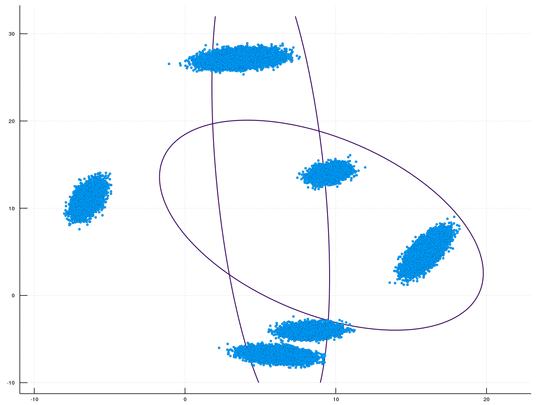

[](https://travis-ci.com/BGU-CS-VIL/DPMMSubClusters.jl)
[](https://coveralls.io/github/dinarior/DPMMSubClusters.jl?branch=master)
[](https://bgu-cs-vil.github.io/DPMMSubClusters.jl/latest/)


# DPMMSubClusters.jl
This is the code repository for the *Julia* package (with an optional [Python wrapper](https://github.com/BGU-CS-VIL/dpmmpython)) that corresponds to our paper, [Distributed MCMC Inference in Dirichlet Process Mixture Models Using Julia](https://www.cs.bgu.ac.il/~dinari/papers/dpmm_hpml2019.pdf), which was presented at CCGrid2019 High Performance Computing Maching Learning workshop (HPML).

Note that due to improvements in the code we have made since the time of the pulication of the paper, this package is now faster than what we reported there.

<br>
<p align="center">

</p>


[Docs are now available](https://bgu-cs-vil.github.io/DPMMSubClusters.jl/stable/).<br>

## Requirements
This package was developed and tested on *Julia 1.0.3*, prior versions will not work.
The following dependencies are required:
- Distributed
- DistributedArrays
- Distributions
- JLD2
- LinearAlgebra
- NPZ
- Random
- SpecialFunctions
- StatsBase


## Installation

Use Julia's package manager:
`(v1.0) pkg> add DPMMSubClusters`

## Usage

This package is aimed for distributed parallel computing, while working with no workers is possible. Adding more workers, distributed across different machines, are encouraged for increased performance.

It is recommended to use `BLAS.set_num_threads(1)`, when working with larger datasets increasing the amount of workers will do the trick, `BLAS` multi threading might disturb the multiprocessing, resulting in slower inference.

For all the workers to recognize the package, you must start with `@everywhere using DPMMSubClusters`. If you require to set the seed (using the `seed` kwarg), add `@everywhere using Random` as well.

The package currently contains priors for handling *Multinomial* or *Gaussian* mixture models.

While being very verstile in the setting and configuration, there are 2 modes which you can work with, either the *Basic*, which will use mostly predefined configuration, and will take the data as an argument, or *Advanced* use, which allows more configuration, loading data from file, and saving the model, or running from a saved checkpoint.

### Basic
In order to run in the basic mode, use the function:
```
labels, clusters, weights = fit(all_data::AbstractArray{Float32,2},local_hyper_params::distribution_hyper_params,α_param::Float32;
        iters::Int64 = 100, init_clusters::Int64 = 1,seed = nothing, verbose = true, save_model = false, burnout = 20, gt = nothing)
```

Or, if opting for the default Gaussian weak prior:
```
labels, clusters, weights = fit(all_data::AbstractArray{Float32,2},α_param::Float32;
        iters::Int64 = 100, init_clusters::Int64 = 1,seed = nothing, verbose = true, save_model = false,burnout = 20, gt = nothing)
```
\* note that while we dispatch on `Float32`, other numbers will work as well, and will be cast if needed.

#### Args and Kwargs:

* all_data - The data, should be `DxN`.
* local_hyper_params - The prior you plan to use, can be either Multinomial, or `NIW` (example below on how to create one)
* α_param - Concetration parameter
* iters - Number of iterations
* seed - Random seed, can also be set seperatly. note that if seting seperatly you must set it on all workers.
* verbose - Printing status on every iteration.
* save_model - If true, will save a checkpoint every 25 iterations, note that if you opt for saving, I recommend the advanced mode.
* burnout - How many iteration before allowing clusters to split/merge, reducing this number will result in faster inference, but with higher variance between the different runs.
* gt - Ground Truth, if supplied will perform `NMI` and `VI` tests on every iteration.

#### Return values:

`fit` will return the following:
```
labels, cluster_params, weights, iteration_time_history, nmi_score_history,likelihood_history, cluster_count_history
```
Note that `weights` does not sum up to `1`, but to `1` minus the weight of the non-instanisated components.

Examples:
[2d Gaussian with plotting](https://nbviewer.jupyter.org/github/dinarior/DPMMSubClusters.jl/blob/master/examples/2d_gaussian/gaussian_2d.ipynb).
[Image Segmentation](https://nbviewer.jupyter.org/github/dinarior/DPMMSubClusters.jl/blob/master/examples/image_seg/dpgmm-superpixels.ipynb).

Reducing the `burnout` will increase the speed and reduce stability, increasing the variance in the results.

When supplied with `gt` kwarg, it will perform `NMI` and `Variation of Information` analysis on each iteration.

The return values for the `fit` methods is:

`labels, clusters, weights, iteration_time, nmi_history, likelihood_history, cluster_count_history`

### Advanced
In this mode you are required to supply a params file, example for one is the file `global_params.jl`.
It includes all the configurable params. Running it is as simple as:
```
dp = dp_parallel(model_params::String; verbose = true, save_model = true, burnout = 5, gt = nothing)
```
Will return:
```
dp, iteration_time_history , nmi_score_history, liklihood_history, cluster_count_history
```

The returned value `dp` is a data structure:
```
mutable struct dp_parallel_sampling
    model_hyperparams::model_hyper_params
    group::local_group
end
```
In which contains the `local_group`, another structure:
```
mutable struct local_group
    model_hyperparams::model_hyper_params
    points::AbstractArray{Float64,2}
    labels::AbstractArray{Int64,1}
    labels_subcluster::AbstractArray{Int64,1}
    local_clusters::Vector{local_cluster}
    weights::Vector{Float64}
end
```

Note that for data loading the package use `NPZ` , which utilize python *numpy* files. Thus the data files must be *pythonic*, and be of the shape `NxD`.

[Example of running from a params file, including saving and loading, with a multinomial prior](https://nbviewer.jupyter.org/github/dinarior/DPMMSubClusters.jl/blob/master/examples/save_load_model/save_load_example.ipynb).

## Additional Functions
Additional function exposed to the user include:

- `run_model_from_checkpoint(file_name)` : Used to restart a saved run, file_name must point to a valid checkpoint file created during a run of the model.  Note that the params files used for running the model initialy must still be available and in the same location, this is true for the data as well.
- `calculate_posterior(model)` : Calculate the posterior of a model, returned from `dp_parallel`.
- `generate_gaussian_data(N::Int64, D::Int64, K::Int64)`: Randomly generates gaussian data, `N` points, of dimension `D` from `K` clusters. return value is `points, labels, cluster_means, cluster_covariance`.
- `generate_mnmm_data(N::Int64, D::Int64, K::Int64, trials::Int64)`: Similar to above, just for multinomial data, the return value is `points, labels, clusters`

### Misc

For any questions: dinari@post.bgu.ac.il

Contributions, feature requests, suggestion etc.. are welcomed.

If you use this code for your work, please cite the following:

```
@inproceedings{dinari2019distributed,
  title={Distributed MCMC Inference in Dirichlet Process Mixture Models Using Julia},
  author={Dinari, Or and Yu, Angel and Freifeld, Oren and Fisher III, John W},
  booktitle={2019 19th IEEE/ACM International Symposium on Cluster, Cloud and Grid Computing (CCGRID)},
  pages={518--525},
  year={2019}
}
```
